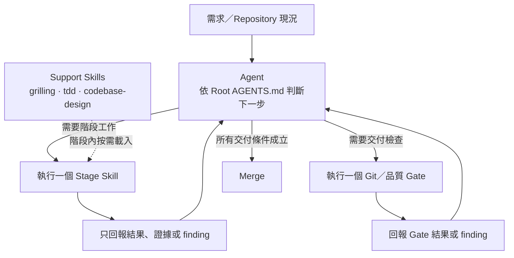
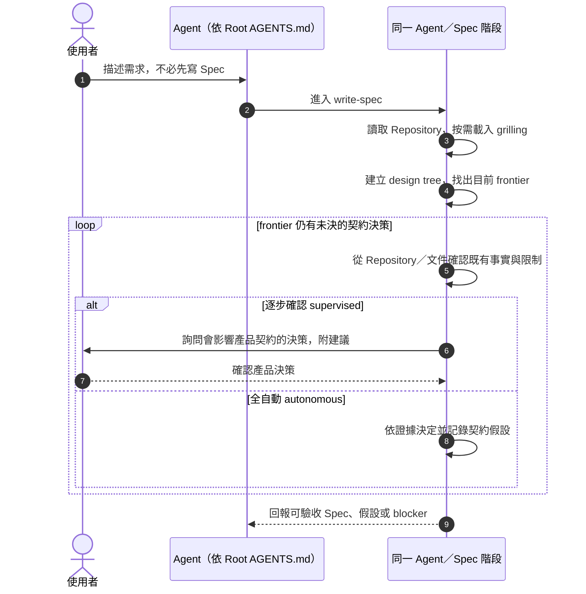
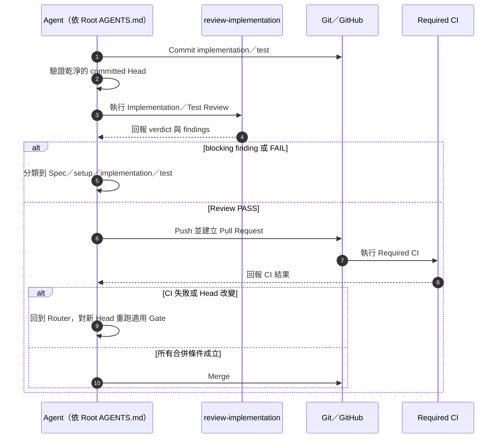

# AI-SDLC Demo

> 讓 AI 不只產生程式碼，而是在可驗收契約、階段責任與交付證據下，從模糊需求走到可驗證交付。

這個 Demo 處理的不是「AI 會不會寫程式」，而是「如何讓 AI 在工程流程中可靠地完成工作」。使用者可以只描述需求；AI 先釐清會改變產品契約的決策，再依同一份 Spec 完成實作、測試、Review 與 Git 交付。

這不是另一組 Prompt，而是把需求管理、責任分工、品質 Gate 與變更追蹤落成 Repository 規則。AI 可以提高自主程度，但驗收標準與交付證據不會因此消失。

## 30 秒看懂

- **Spec 是追問出來的**：AI 先從 Repository、測試與文件確認既有事實，只把會影響外部行為、驗收條件或重要邊界的決策交給使用者，或在全自動模式中依證據決定並記錄假設。
- **流程由 Agent 控制**：root [`AGENTS.md`](AGENTS.md) 是唯一的跨階段 Router。每個 Stage Skill 完成後只回報結果，Agent 再依目前狀態決定下一步。
- **Skill 只提供階段內方法**：Stage Skills 負責一個生命週期階段；Support Skills 提供追問、TDD 或設計方法，不會自行串接下一個 Stage。
- **交付以證據為準**：最終 Validation 與 Review 對準乾淨的 committed Head；Push、PR、CI 與 Merge 都有明確 Gate。

## 控制模型：Agent 決策，Skill 執行後返回



`AGENTS.md` 不是額外的 Runtime、狀態機或流程腳本，而是 Agent 的路由規則。Agent 每次收到 Stage 結果後，都以 Repository 當下可觀察的契約、程式碼與交付證據重新判斷下一步。

之所以能分階段，是因為每個階段都有清楚的**觸發條件、責任、完成結果與驗證條件**；Agent 不需要另外持久化「流程走到哪裡」。

## Spec 如何從需求產生

使用者不必先寫好 Spec。`write-spec` 會載入 `grilling`，以 design tree 排出契約決策的前置關係，再從目前可回答的 frontier 逐步收斂。既有程式、測試、文件或可信來源已能回答的現況，由 AI 自行確認，不轉嫁成問題。

下面的參與者代表同一個 Agent 在不同責任下的行為，不是彼此呼叫的額外服務。



`design tree` 用來管理決策依賴；`frontier` 是前置條件已成立、此刻真正需要處理的決策。這讓追問集中在產品契約，而不是一次丟出大量問題或提前鎖死實作細節。

例如 Java 版本與測試命令可直接從 Repository 確認；非法輸入要回 `400` 還是 `422`，才是需要詢問或在 autonomous 模式中明示假設的契約決策。

## Agent 與 Skills 的責任邊界

| 元件 | 責任 | 不負責 |
| --- | --- | --- |
| Agent（依 Root `AGENTS.md`） | 讀取目前狀態、選擇下一階段、分類 findings、執行 Git 交付 Gate | 不把跨階段控制交給 Skill |
| Stage Skill | 完成一個階段，回報結果、證據與 blocker | 不啟動下一個 Stage |
| Support Skill | 提供目前階段需要的方法 | 不決定生命週期與交付順序 |

### Stage Skills

| Skill | 單一責任 |
| --- | --- |
| `write-spec` | 把需求與 Spec finding 整理成可實作、可驗收的產品契約。 |
| `prepare-project` | 建立目前交付需要的最小、可重現 build/test 基線。 |
| `implement-spec` | 依已成立的 Spec，以可驗收切片與 TDD 完成產品碼及測試。 |
| `review-implementation` | 對精確 committed Head 分別執行 Implementation Review 與 Test Review，輸出 verdict 與 findings。 |

### Support Skills

| Skill | 階段內用途 |
| --- | --- |
| `grilling` | 用 design tree／frontier 釐清真正需要決定的產品問題。 |
| `tdd` | 提供 Red → Green、public test seam、測試品質與 mocking 準則。 |
| `codebase-design` | 提供 module、interface、seam 與責任配置的設計方法。 |

通用 Skill 的精煉原則是：**保留核心方法、移除跨階段控制、對齊 supervised／autonomous 模式、縮小成單一責任，並按需載入**。因此方法可以重用，生命週期仍由 Repository 的 Router 管理。

## 交付 Gate：從 Commit 到 Merge



完整證據鏈是：

`Spec → implementation／test → Commit → committed-Head Validation → Implementation／Test Review → Push → PR → CI → Merge`

Review、PR review 或 CI 的 blocking finding 一律回到 Root Router，由它依責任分流到 Spec、setup、implementation 或 test。任何新 Commit，或 Merge 前整合更新後的 `main`，都會形成新 Head，先前證據不能直接沿用。

## 實際 Demo 證據

Spring Boot 範例已用完整交付閉環完成一個最小產品功能：任意大小十進位整數的加法 API。

| 證據 | 結果 |
| --- | --- |
| 產品契約 | [`specs/addition-api.md`](specs/addition-api.md) 定義公開行為、邊界、錯誤與非目標。 |
| 實作與測試 | [`AdditionController.java`](examples/spring-boot/src/main/java/com/github/kof1016/aiworkflowdemo/AdditionController.java) 與 [`AdditionApiTests.java`](examples/spring-boot/src/test/java/com/github/kof1016/aiworkflowdemo/AdditionApiTests.java)。 |
| Review | Implementation Review 與 Test Review 都為 PASS；保留一項未阻擋交付的未來 JDK 相容性提醒。 |
| PR／CI | [PR #12](https://github.com/kof1016/ai-work-flow-demo/pull/12) 完成 11 項測試；[Spring Boot CI run #11](https://github.com/kof1016/ai-work-flow-demo/actions/runs/32611234214) 通過。 |
| Merge | 合併至 `main`：[`25681d6`](https://github.com/kof1016/ai-work-flow-demo/commit/25681d6bf9568aeb9d8ca113975988ed5fef13b4)。 |

這些連結提供可追溯證據，但不代表此 Demo 已經過大規模或長期生產驗證。

## 執行模式

| 編號 | 模式 | 契約決策 | 交付行為 |
| --- | --- | --- | --- |
| 1 | 逐步確認（supervised） | 依 frontier 分輪詢問，使用者確認後 Spec 才成立；未指定時使用此模式。 | 依目前任務與已確認決策繼續執行。 |
| 2 | 全自動（autonomous） | 使用同一套 design tree／frontier 作為內部推理，依證據定稿並記錄影響契約的假設。 | 自動完成 Commit、Push、PR、CI 驗證與符合條件後 Merge；只有硬阻塞或明確排除才停止。 |

模式改變的是決策與自動化程度，不會省略適用的 Spec、TDD、Validation 或 Review。可用「切換到逐步確認／全自動」或 `switch to supervised/autonomous` 切換目前任務。

## 最短使用方式

把需求直接交給支援 Repository 規則與 Skills 的 coding Agent；不需要先代替 AI 撰寫 Spec。

```text
請先讀取 AGENTS.md 與 CONVERSATION_RULES.md，切換到全自動模式，
依 Repository 規則完成以下需求：

<用自然語言描述需求>
```

若希望逐項確認產品決策，把「全自動模式」改成「逐步確認模式」。

## Repository 結構

```text
.agents/skills/           Repository-scoped Skills
  write-spec/             產生可驗收 Spec
  prepare-project/        建立 build/test 基線
  implement-spec/         依 Spec 實作與測試
  review-implementation/  Implementation／Test Review
  grilling/               需求追問方法
  tdd/                    TDD 與測試方法
  codebase-design/        Codebase 設計方法
.github/                  PR template 與 CI
examples/
  spring-boot/            可執行的 Spring Boot Demo
specs/                    目前產品行為契約
AGENTS.md                 唯一的跨階段 Router 規則
CONVERSATION_RULES.md     對話與回覆規則
THIRD_PARTY_NOTICES.md    第三方來源與授權
```

## Spring Boot 範例

[`examples/spring-boot/`](examples/spring-boot/) 是這套流程的可執行驗證載體，使用 Java 25 與 Maven Wrapper，提供具明確契約、錯誤邊界與自動測試的 `GET /add` API。

進入 `examples/spring-boot/` 後驗證：

```bash
./mvnw --batch-mode --no-transfer-progress verify
```

啟動並呼叫 API：

```bash
./mvnw spring-boot:run
curl "http://localhost:8080/add?a=1&b=2"
# {"result":"3"}
```

Windows 使用 `mvnw.cmd`。[GitHub Actions](.github/workflows/spring-boot.yml) 會在 Pull Request 與 `main` 更新時執行相同的 Maven 驗證。

## 移植到實際專案

可移植的是控制觀念，而不是 Spring Boot 範例本身：保留 Spec 契約、Router／Skill 邊界、committed-Head 證據與 finding 回流，再替換實際專案的技術棧、build/test 命令、品質 Gate、CI 與團隊治理規則。

這是一個用來驗證設計的 Demo，不宣稱是成熟框架，也不宣稱已經過大規模生產環境驗證。

## 第三方來源

`grilling`、`tdd` 與 `codebase-design` 來自 [mattpocock/skills](https://github.com/mattpocock/skills) `v1.2.3`。保留內容、本地調整範圍與 MIT License 見 [`THIRD_PARTY_NOTICES.md`](THIRD_PARTY_NOTICES.md)。
