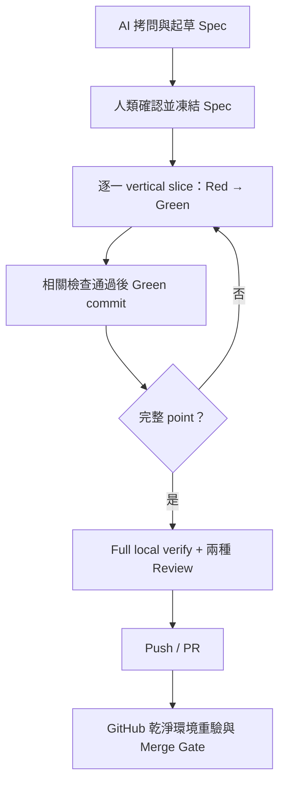

# AI-SDLC Demo 交接包 v2.0

狀態：**第一階段權威版本**

基準日：2026-08-21

## 作廢聲明

這個 v2.0 交接包取代所有 v1 ZIP、`deliverables` 中途草稿與先前討論衍生文件。舊檔只能作稽核證據，不能再作規則、命令、Skill 清單或實作來源；若內容衝突，以本包為準。

## 本階段交付邊界

本包只完成：

- 舊文件稽核與決策重建。
- `AGENTS.md` 入口索引。
- 本機優先的 AI-SDLC 規則、工作流與 Review 契約。
- Matt Pocock Skills 的 pinned 稽核、精確選擇及 repo-scope 自動安裝。
- 未來 GitHub CI/CD 與 Gate Drill 的設計契約。

本包沒有：

- 實作 A+B。
- 猜測 A+B 的技術棧、驗收條件或測試命令。
- 建立 `.github/workflows/`、GitHub Repository、branch ruleset、secrets 或 Codex Cloud environment。
- 建立假的 Spec、issue tracker、triage labels、ADR、coverage threshold 或 repair policy。

A+B 只是下一階段承載流程的最小功能；需求必須另行拷問、確認並凍結後才能實作。

## 最小工作流

三種自動化模式只改變 Approval Gates；圖中的品質步驟不會因模式而消失。完整規則見 [工作流](docs/WORKFLOW.md)。

## 文件索引

| 文件 | 用途 |
|---|---|
| [AGENTS.md](AGENTS.md) | Codex 的最小入口索引 |
| [docs/AUDIT.md](docs/AUDIT.md) | 舊版衝突、過時假設與處置 |
| [docs/RULES.md](docs/RULES.md) | 權威原則、權限邊界與真實來源 |
| [docs/WORKFLOW.md](docs/WORKFLOW.md) | Spec、TDD、commit、Push、CI 與模式切換 |
| [docs/REVIEWS.md](docs/REVIEWS.md) | Implementation Review 與 Test Review 契約 |
| [docs/SKILLS.md](docs/SKILLS.md) | 35 個候選的稽核與精確 3 個 Skill 的用法 |
| [docs/BOOTSTRAP.md](docs/BOOTSTRAP.md) | 下一階段由 Codex 執行的 repo bootstrap |
| [docs/CI-CD.md](docs/CI-CD.md) | 尚未實作的 GitHub gates 設計契約 |
| [docs/SOURCES.md](docs/SOURCES.md) | pinned 與官方來源、驗證日期 |
| [THIRD_PARTY_NOTICES.md](THIRD_PARTY_NOTICES.md) | 第三方授權聲明 |

## 使用方式

1. 把整個目錄作為新 public repository 的初始內容，或複製到尚未 bootstrap 的目標 repo 根目錄。
2. 由 Codex 先讀 `AGENTS.md`，再依 [Bootstrap](docs/BOOTSTRAP.md) 執行；不要求使用者手動安裝 Skill。
3. 一次性 pre-remote Bootstrap profile 只適用於匯入本包與安裝 Skills；第一次 Push 後即退役。
4. 第一個後續 point 開始前，先產出、確認並凍結真實 Spec；沒有 frozen Spec 就不進實作。
