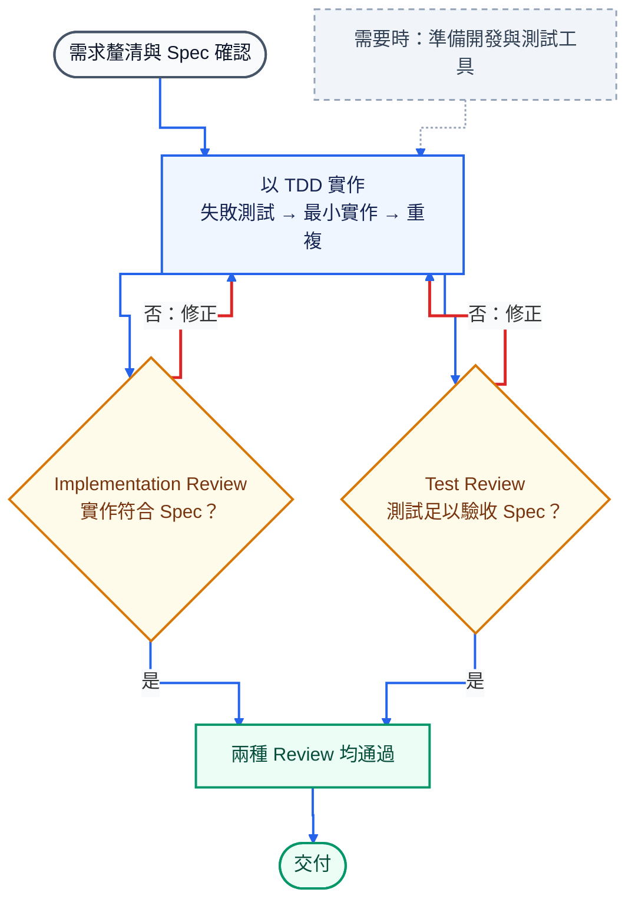

# Trying to Control AI

> 我試著控制 AI——不是限制它思考，而是讓它先跟你一起理清規格與功能邊界，再開始寫程式。

AI 寫得很快；真正讓人不安的，往往不是它完全做錯，而是它做得比你要求更多：

- 自行補上沒有說出口的假設。
- 順手增加功能，或為想像中的擴充性多做幾層架構。
- 程式能跑、測試也通過，人卻還是不確定這是不是自己真正要的。

這個 Demo 把 AI 的推理能力用在更前面：先一起把需求、功能邊界與驗收方式說清楚，確認 Spec，再依同一份內容完成實作、測試、Review 與交付。

流程規則與 Skills 直接放在 Repository 裡，由 AI 根據目前結果判斷下一步；不需要另外撰寫一個外部流程程式，把每一步硬編碼起來。

信任不是要 AI 保證不犯錯，而是讓影響產品的決定與最後如何驗收，都能被看見。

## 這套流程怎麼運作

需求不是問一次就結束。使用者與 AI 會持續釐清問題、確認取捨，直到共同確認 Spec，再把它帶進後續工作。



可測的產品行為會在實作階段以 TDD 的小循環逐步完成。兩種 Review 都通過才進入交付；紅色實線代表實際的修正路徑。修正後會重新執行適用檢查，並重做兩種 Review。

### 對應的 Skill

| 工作 | Skill |
| --- | --- |
| 釐清需求並確認 Spec | `write-spec` |
| 按需準備開發與測試工具 | `prepare-project` |
| 依 Spec 以 TDD 實作 | `implement-spec` |
| Implementation／Test Review | `review-implementation` |

## 每一步都能被檢查

| 階段 | 留下的內容 | 它回答的問題 |
| --- | --- | --- |
| Spec | 產品行為、輸入邊界與驗收條件 | AI 理解的是不是使用者要的？ |
| 實作與測試 | 產品程式碼與可執行的驗收測試 | 實際做了什麼，又如何證明？ |
| 兩種 Review | 實作與測試各自的審查結果 | 有沒有越界？測試真的驗得到嗎？ |
| 交付 | 明確版本與完整檢查結果 | 最後交付的是哪個版本？ |

## 如何使用

把自然語言需求交給支援 Repository 規則與 Skills 的 coding Agent：

```text
請先讀取 AGENTS.md 與 CONVERSATION_RULES.md，
依 Repository 規則完成以下需求：

<用自然語言描述需求>
```

預設採逐步確認：AI 提出問題與建議，重要決策由使用者確認後再繼續。

## Repository 結構

工作流不綁定技術棧；`examples/spring-boot/` 只是目前的可執行示範專案，可以換成其他語言或框架。

```text
.
├── .agents/
│   └── skills/
│       ├── write-spec/             釐清並產生可驗收的 Spec
│       ├── prepare-project/        按需準備開發與測試工具
│       ├── implement-spec/         依 Spec 實作產品與測試
│       ├── review-implementation/  Implementation／Test Review
│       ├── grilling/               需求追問方法
│       ├── tdd/                    TDD 方法
│       └── codebase-design/        Codebase 設計方法
├── .github/
│   ├── pull_request_template.md    交付與 Review 紀錄格式
│   └── workflows/
│       └── spring-boot.yml         示範專案的 GitHub Actions CI
├── examples/
│   └── spring-boot/                可執行的示範專案，可替換技術棧
├── AGENTS.md                       工作流與交付規則
├── CONVERSATION_RULES.md           對話與回覆規則
└── THIRD_PARTY_NOTICES.md          第三方來源與授權
```

<details>
<summary>執行目前的示範專案</summary>

目前的示範專案使用 Java 25。進入 `examples/spring-boot/` 後執行：

```bash
./mvnw --batch-mode --no-transfer-progress verify
```

Windows 使用 `mvnw.cmd`。

</details>

## 需要時，AI 也會準備開發與測試工具

若目標專案還不能穩定建置或測試，AI 會沿用既有技術棧，依目前需求補齊最少必要的設定、依賴與命令，讓格式、lint／靜態分析、型別／編譯、單元／整合測試與建置可以重複執行。實際項目由專案需求決定；已有適用工具時不會另建一套。

## GitHub CI

Pull Request 與 `main` 更新時，[GitHub Actions](.github/workflows/spring-boot.yml) 會在獨立環境重跑示範專案定義的完整檢查，其中包含測試。CI 是對同一套檢查的重驗證，不是另一套測試流程。

## 第三方來源

`grilling`、`tdd` 與 `codebase-design` 來自 [mattpocock/skills](https://github.com/mattpocock/skills) `v1.2.3`。保留內容、本地調整範圍與 MIT License 見 [`THIRD_PARTY_NOTICES.md`](THIRD_PARTY_NOTICES.md)。
