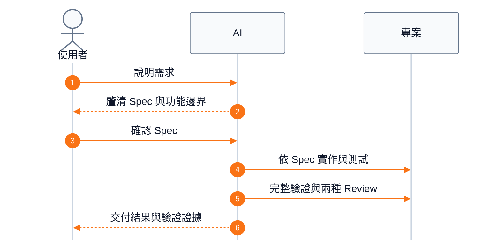
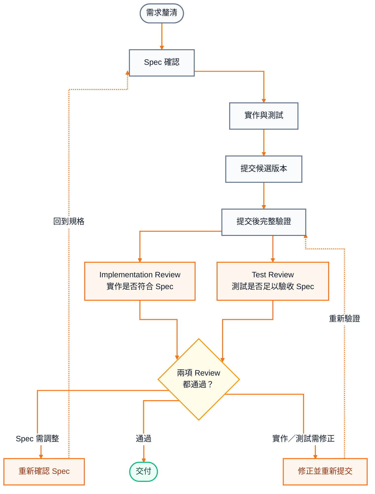

# AI-SDLC Demo

> 讓 AI 跟你一起理清規格與功能邊界，再開始寫程式。

第一次把需求交給 AI，通常很驚豔：幾句話、幾分鐘，就得到一大段能跑的程式碼。

但用久之後，人很容易變成從頭跟到尾的 QA。程式跑得動、測試也通過，卻還是不確定 AI 做的是不是自己真正要的；更麻煩的是，它經常不是完全做錯，而是做得比要求更多。

AI 不像傳統程式，只執行固定流程。它會理解語意、推論缺口，再補上它認為合理的答案。猜對時很神奇；猜錯時，可能跳過必要步驟、順手增加功能，或為想像中的擴充性多抽幾層架構。最後沒有人確定：哪些東西真的有必要？

這個 Demo 不試圖讓 AI 停止推論，而是把它的推理能力用在更前面：先協助使用者把需求、邊界與驗收方式說清楚，確認 Spec，再依同一份內容完成實作、測試、Review 與交付。

信任不是靠 AI 保證自己不會犯錯，而是讓影響產品契約的假設、功能邊界，以及最後如何驗收，都能被看見。這不能消除所有錯誤，但能讓問題更早浮現，也更容易回到正確的地方修正。

```text
常見方式：需求 → 直接寫 Code → 收到大量結果 → 人開始追著驗收與修正
這個 Demo：需求 → 一起釐清 → 確認 Spec → 實作與測試 → Review → 交付
```

## 一個 A＋B，真的有那麼簡單嗎？

「做一個 A＋B API」聽起來簡單到不能再簡單。真的開始定義時，問題卻會一個個冒出來：

- 要用什麼介面？
- 只接受整數，還是也包含小數？負數呢？
- 數字超出 32 或 64 位元時怎麼辦？
- 無效輸入回什麼狀態？
- 結果是 JSON number 還是 string？
- 哪些功能明確不做？

這些不是枝微末節，而是「做對」究竟代表什麼。

Repository 裡的實際範例最後收斂為：`GET /add`、任意位數十進位整數、無效輸入回 `400`、結果以字串表示，並明確排除小數、其他運算與持久化。完整契約見 [`specs/addition-api.md`](specs/addition-api.md)。

## 先確認，再動手

使用者不需要先寫好完整規格，只要先說明需求。AI 會把影響產品行為的重要決定攤開，與使用者確認後再往下做。

下圖呈現預設的逐步確認模式；在全自動模式中，AI 會依證據定稿，並記錄影響產品契約的假設。



重點不是讓 AI 少思考，而是讓它先幫忙找出人可能遺漏的產品決定，再把已確認的內容帶進後續工作。

## 從 Spec 到交付

主流程保持簡單：一路往下完成工作。Blocking finding 或 Overall FAIL 必須回到對應階段；non-blocking finding 不強制回流，但若決定修正，新 Commit 仍須重新驗證與 Review。



這裡刻意把 Review 分成兩個視角：

- **Implementation Review**：確認實作符合 Spec、沒有越界，也沒有不必要的功能或抽象。
- **Test Review**：確認測試本身真的能驗收行為與風險，不只是看測試有沒有變綠。

兩種 Review 都對準同一個已提交版本。Blocking finding 或 Overall FAIL 會依問題責任分流：規格問題回到 `write-spec`；setup 問題回到 `prepare-project`；實作或測試問題回到 `implement-spec`。Non-blocking finding 可以和 PASS 共存；若仍決定修正，新 Commit 也要重新完成完整驗證與兩種 Review。圖中只畫最常見的 Spec 與實作／測試回圈，避免讓例外分支淹沒主流程。

## 實際 Demo 證據

Spring Boot 範例保留這套流程的一組可追溯交付產物：任意大小十進位整數的加法 API。

| 證據 | 結果 |
| --- | --- |
| Spec | [`specs/addition-api.md`](specs/addition-api.md) 定義公開行為、邊界、錯誤與非目標。 |
| 實作與測試 | [`AdditionController.java`](examples/spring-boot/src/main/java/com/github/kof1016/aiworkflowdemo/AdditionController.java) 與 [`AdditionApiTests.java`](examples/spring-boot/src/test/java/com/github/kof1016/aiworkflowdemo/AdditionApiTests.java)。 |
| Review | [PR #12](https://github.com/kof1016/ai-work-flow-demo/pull/12) 記錄 Implementation Review PASS；Test Review PASS，並保留一項不阻擋交付的未來 JDK 相容性 setup 提醒。 |
| CI | [Spring Boot CI run #11](https://github.com/kof1016/ai-work-flow-demo/actions/runs/32611234214) 實際執行 11 項測試並通過。 |
| Merge | 已合併至 `main`：[`25681d6`](https://github.com/kof1016/ai-work-flow-demo/commit/25681d6bf9568aeb9d8ca113975988ed5fef13b4)。 |

## 最短使用方式

把自然語言需求交給支援 Repository 規則與 Skills 的 coding Agent：

```text
請先讀取 AGENTS.md 與 CONVERSATION_RULES.md，
依 Repository 規則完成以下需求：

<用自然語言描述需求>
```

預設會使用逐步確認模式；若要快速測試整條流程，可要求「切換到全自動模式」。

## 逐步確認與全自動

| 模式 | 適合情境 | 行為 |
| --- | --- | --- |
| 逐步確認（supervised） | 希望參與產品決策 | AI 提出問題與建議，使用者確認後才讓 Spec 成立；這是預設模式。 |
| 全自動（autonomous） | 快速測試完整流程 | AI 依 Repository 證據定稿並記錄影響契約的假設，自動完成 Commit、Push、PR、Required CI 驗證與條件成立後 Merge；只有硬阻塞或明確排除才停止。 |

模式改變的是決策方式與自動化程度，不會略過適用的 Spec、測試、驗證或 Review。

## Skill 是能力，不是流程

每個 Skill 只負責一件事。完成目前階段後，它會回報結果；root [`AGENTS.md`](AGENTS.md) 的 Router 再根據目前證據判斷下一步。

| Step | 這一步在確認什麼 | 對應 Skill |
| --- | --- | --- |
| 需求釐清、Spec 確認 | 收斂產品行為、重要邊界與驗收條件 | `write-spec` |
| 按需準備環境 | 建立目前交付所需的最小、可重現 build/test 基線 | `prepare-project` |
| 實作與測試 | 依已成立的 Spec 完成產品碼與測試 | `implement-spec` |
| Implementation Review | 審查 Spec 符合度、正確性、越界與維護風險 | `review-implementation` 的第一個視角 |
| Test Review | 審查測試設計、重要路徑與實際執行證據 | `review-implementation` 的第二個視角 |

兩種 Review 是同一個 `review-implementation` Skill 的獨立視角，沒有固定先後。`grilling`、`tdd` 與 `codebase-design` 則是階段內按需使用的方法，不負責切換流程。

Candidate Commit、完整驗證、finding 分流與 Git 交付由 Router 負責，不需要再包成 Skill。這在概念上接近依結果轉移狀態，但不是由外部程式硬編碼整條流程；Agent 每次收到階段結果後，都會依目前證據重新判斷。

Skill 也不是越多越好。責任重複、判斷衝突或容易誤觸的能力，反而會讓 AI 更難知道自己此刻應該做什麼；因此這裡優先保持簡單與單一職責。

### Setup 按需要出現

主流程沒有固定的 Setup 步驟。只有缺少可重現的 build/test 基線，或出現 setup finding 時，Router 才會插入 `prepare-project`。

流程本身不綁定 Spring Boot、Java 或特定工具。`prepare-project` 會沿用既有技術棧，建立目前交付所需的最小基線，實際執行 build/test，再交回 Router 決定下一步。

## Repository 結構

```text
.agents/skills/           Repository-scoped Skills
  write-spec/             產生可驗收 Spec
  prepare-project/        按需建立 build/test 基線
  implement-spec/         依 Spec 實作與測試
  review-implementation/  Implementation／Test Review
  grilling/               需求追問方法
  tdd/                    TDD 與測試方法
  codebase-design/        Codebase 設計方法
.github/                  PR template 與 CI
examples/spring-boot/     可執行的 Spring Boot Demo
specs/                    目前產品行為契約
AGENTS.md                 跨階段 Router 規則
CONVERSATION_RULES.md     對話與回覆規則
THIRD_PARTY_NOTICES.md    第三方來源與授權
```

## 執行 Spring Boot 範例

範例使用 Java 25 與 Maven Wrapper。進入 `examples/spring-boot/` 後驗證：

```bash
./mvnw --batch-mode --no-transfer-progress verify
```

先在一個終端啟動應用程式：

```bash
./mvnw spring-boot:run
```

再於另一個終端呼叫 API：

```bash
curl "http://localhost:8080/add?a=1&b=2"
# {"result":"3"}
```

Windows 使用 `mvnw.cmd`。

## 第三方來源

`grilling`、`tdd` 與 `codebase-design` 來自 [mattpocock/skills](https://github.com/mattpocock/skills) `v1.2.3`。保留內容、本地調整範圍與 MIT License 見 [`THIRD_PARTY_NOTICES.md`](THIRD_PARTY_NOTICES.md)。
