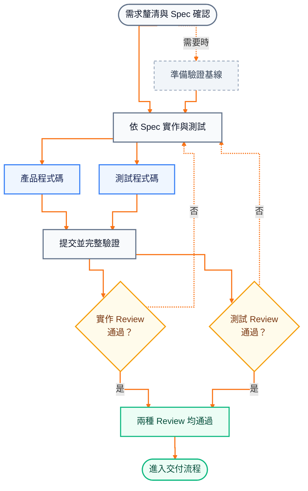

# Trying to Control AI

> 我試著控制 AI——不是限制它思考，而是讓它先跟你一起理清規格與功能邊界，再開始寫程式。

AI 寫得很快；真正讓人不安的，往往不是它完全做錯，而是它做得比你要求更多：

- 自行補上沒有說出口的假設。
- 順手增加功能，或為想像中的擴充性多做幾層架構。
- 程式能跑、測試也通過，人卻還是不確定這是不是自己真正要的。

這個 Demo 把 AI 的推理能力用在更前面：先一起把需求、功能邊界與驗收方式說清楚，確認 Spec，再依同一份內容完成實作、測試、Review 與交付。

信任不是要 AI 保證不犯錯，而是讓影響產品的決定與最後如何驗收，都能被看見。

## 一個 A＋B，真的那麼簡單嗎？

「做一個 A＋B API」看起來不能再簡單，但介面、可接受的數值、錯誤回應，以及哪些功能明確不做，都需要先決定。

這個例子刻意保持簡單，讓真正的主角回到需求如何被問清楚、收斂並成為可驗收的 Spec。實際結果見 [`specs/addition-api.md`](specs/addition-api.md)。

## 整個工作流

需求不是問一次就結束。使用者與 AI 會持續釐清問題、確認取捨，直到共同確認 Spec，再把它帶進後續工作。



- **Implementation Review**：確認產品程式碼符合 Spec，沒有越界或不必要的複雜度。
- **Test Review**：確認測試本身足以驗收 Spec，而不只是看測試有沒有變綠。

圖中的「否」以虛線畫出最常見的實作／測試修正回圈。實際上，Review finding 會依責任回到 Spec、驗證基線或實作／測試；任何修正都要重新提交、完整驗證，並重做兩種 Review。

## 流程留下什麼

A＋B 範例保留了從需求到交付的可追溯產物：

| 產物 | 實際證據 |
| --- | --- |
| Spec 文件 | [`specs/addition-api.md`](specs/addition-api.md) 記錄產品行為、邊界、錯誤與非目標。 |
| 產品程式碼 | [`AdditionController.java`](examples/spring-boot/src/main/java/com/github/kof1016/aiworkflowdemo/AdditionController.java)。 |
| 測試程式碼 | [`AdditionApiTests.java`](examples/spring-boot/src/test/java/com/github/kof1016/aiworkflowdemo/AdditionApiTests.java)。 |
| Review 紀錄 | [PR #12](https://github.com/kof1016/trying-to-control-ai/pull/12) 記錄 Implementation Review 與 Test Review 結果。 |
| 交付證據 | [GitHub Actions run #11](https://github.com/kof1016/trying-to-control-ai/actions/runs/32611234214) 與合併至 `main` 的 [`25681d6`](https://github.com/kof1016/trying-to-control-ai/commit/25681d6bf9568aeb9d8ca113975988ed5fef13b4)。 |

## Skill 如何分工

每個 Skill 只完成一項責任；完成後回報結果，再由 root [`AGENTS.md`](AGENTS.md) 根據目前證據判斷下一步。

| Step | Skill |
| --- | --- |
| 釐清需求並確認 Spec | `write-spec` |
| 按需建立驗證基線 | `prepare-project` |
| 實作產品與測試 | `implement-spec` |
| Implementation／Test Review | `review-implementation` |

兩種 Review 是同一個 `review-implementation` Skill 的獨立視角，沒有固定先後。`grilling`、`tdd` 與 `codebase-design` 則是階段內按需使用的方法，不負責切換流程。

整條工作流主要由 Repository 規則、Skills 與 AI 的判斷銜接，沒有另外撰寫一個外部程式把每一步硬編碼起來。

## 最短使用方式

把自然語言需求交給支援 Repository 規則與 Skills 的 coding Agent：

```text
請先讀取 AGENTS.md 與 CONVERSATION_RULES.md，
依 Repository 規則完成以下需求：

<用自然語言描述需求>
```

預設採逐步確認：重要決策由使用者確認後再繼續。全自動模式則由 AI 依 Repository 證據與建議選項定稿，記錄影響契約的假設，並自動完成後續交付。

## Repository 結構

```text
.
├── .agents/
│   └── skills/
│       ├── write-spec/             釐清並產生可驗收的 Spec
│       ├── prepare-project/        按需建立驗證基線
│       ├── implement-spec/         依 Spec 實作產品與測試
│       ├── review-implementation/  Implementation／Test Review
│       ├── grilling/               需求追問方法
│       ├── tdd/                    測試先行方法
│       └── codebase-design/        Codebase 設計方法
├── .github/
│   ├── pull_request_template.md    交付與 Review 紀錄格式
│   └── workflows/
│       └── spring-boot.yml         GitHub Actions CI
├── examples/
│   └── spring-boot/                可執行的 Java 範例
├── specs/
│   └── addition-api.md             A＋B 產品 Spec
├── AGENTS.md                       跨階段 Router 規則
├── CONVERSATION_RULES.md           對話與回覆規則
└── THIRD_PARTY_NOTICES.md          第三方來源與授權
```

## 重現 Java 範例

準備 JDK 25，進入 `examples/spring-boot/` 後執行完整驗證：

```bash
./mvnw --batch-mode --no-transfer-progress verify
```

啟動應用程式後，可從另一個終端呼叫 API：

```bash
./mvnw spring-boot:run
```

```bash
curl "http://localhost:8080/add?a=1&b=2"
# {"result":"3"}
```

Windows 使用 `mvnw.cmd`。

## 開發環境與驗證基線

這套流程不綁定語言。AI 會先沿用專案既有技術棧；缺少可重現的驗證基線時，再補齊目前交付所需的最小專案設定、依賴與命令，讓適用的格式檢查、靜態分析、編譯、測試與建置可以重複執行。

下表是常見例子，不是五套固定 preset；實際工具仍以目標專案既有選擇為優先。

| 技術棧 | 常見工具 | 主要驗證項目 |
| --- | --- | --- |
| Java | JDK、Maven／Gradle Wrapper、Spotless／Checkstyle、JUnit | 格式與風格、編譯器警告、編譯、測試、封裝 |
| Go | Go toolchain、`gofmt`、`go vet`、`go test`、`go build` | 格式、可疑程式結構、測試、建置 |
| C++ | GCC／Clang／MSVC、CMake、clang-format、clang-tidy、CTest | 格式、靜態分析、編譯、測試 |
| C# | .NET SDK、`dotnet format`、Roslyn analyzers、`dotnet build`、`dotnet test` | 格式與 analyzer、編譯、測試 |
| NestJS／TypeScript | Node.js、專案既有 package manager、ESLint、Prettier、TypeScript／Nest CLI、Jest／Supertest | 格式、lint、型別檢查、單元／整合測試、建置 |

目前 Repository 內的 Java 範例以 Maven `verify` 一次執行 Spotless 格式檢查、以 `javac -Xlint:all -Werror` 編譯 main／test、全部測試與應用程式封裝；實際設定見 [`pom.xml`](examples/spring-boot/pom.xml)。

## GitHub CI

Pull Request 與 `main` 更新時，[GitHub Actions](.github/workflows/spring-boot.yml) 會在 Ubuntu／Temurin 25 上重跑同一條 Maven `verify`。它提供獨立環境的重驗證，不是另一套測試流程。

## 第三方來源

`grilling`、`tdd` 與 `codebase-design` 來自 [mattpocock/skills](https://github.com/mattpocock/skills) `v1.2.3`。保留內容、本地調整範圍與 MIT License 見 [`THIRD_PARTY_NOTICES.md`](THIRD_PARTY_NOTICES.md)。
