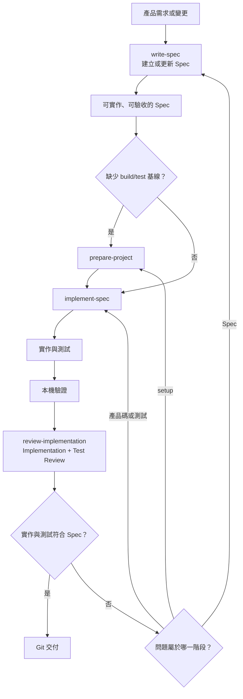
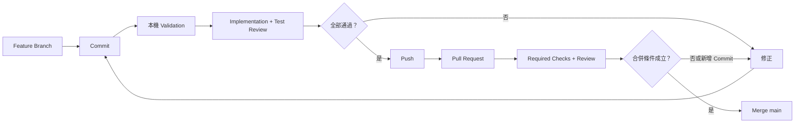

# AI-SDLC Demo

這個專案示範如何把 AI 放進一套完整的開發流程。重點不只是產生程式碼，而是讓需求、實作、測試、審查與 Git 交付各有清楚的責任和通過條件。

框架可以用於任何程式語言與技術棧。Java、Python、TypeScript 或其他技術都能使用；`examples/` 裡的 Spring Boot 專案只是可執行範例，不是框架前提。

## 設計重點

- **Spec 是共同契約**：需求、實作、測試與 Review 對照同一份可驗收的產品行為。
- **階段責任分開**：[`AGENTS.md`](AGENTS.md) 負責路由，Skills 分別處理 Spec、setup、implementation 與 review。
- **按需載入規則**：只在任務需要時讀取對應 Skill，避免無關指令占用上下文。
- **框架與技術棧分離**：語言與建置工具放在各自的 `examples/<project>/`，不進入框架規則。
- **交付結果可追蹤**：同一個 Feature Branch 與 Pull Request 完成驗證、Review、CI 與 Merge。

## 從 Spec 到交付

開發前先用 Spec 寫清楚「要做什麼」和「怎樣算完成」，之後的實作、測試與 Review 都對照同一份 Spec。Spec 關注可觀察行為、驗收條件與重要邊界，不預先指定實作細節。



如果只是準備環境或補齊 build/test，不另外建立產品 Spec。以明確的 setup task 為準，流程是 `prepare-project → 本機驗證 → review-implementation`。

### 執行模式

| 編號 | 模式 | 行為 |
| --- | --- | --- |
| 1 | 逐步確認（supervised） | 遇到未決事項時逐步詢問使用者；未指定時使用此模式。 |
| 2 | 全自動（autonomous） | 自動完成 Commit、Push、PR、CI 與符合條件後 Merge；只有硬阻塞或使用者明確排除的操作才停止。 |

模式只改變決策與執行方式，不會省略適用的 Spec、TDD、Validation 或 Review。

## Git 交付流程



每個需求只開一個 Feature Branch 和一個 Pull Request。只要新增 Commit，就重跑本機驗證、Implementation Review 與 Test Review；如果 `main` 有更新，先整合到同一個 Feature Branch 再重跑。

## 核心 Skills

| Skill | 責任 |
| --- | --- |
| `write-spec` | 寫清楚要做什麼，以及怎樣算完成。 |
| `prepare-project` | 補齊可重現的 build/test 環境。 |
| `implement-spec` | 依 Spec 完成產品碼與測試。 |
| `review-implementation` | 獨立檢查實作與測試，提出 findings 並給出 verdict。 |

支援 Skills `grilling`、`tdd`、`codebase-design` 保留上游原文；來源與授權見 [`THIRD_PARTY_NOTICES.md`](THIRD_PARTY_NOTICES.md)。

## Repository 結構

```text
.agents/skills/           Repository-scoped Skills
.github/                  PR template 與 CI
examples/                 彼此獨立的語言／框架範例
  spring-boot/            Minimal Spring Boot shell
AGENTS.md                 AI 執行與交付規則
CONVERSATION_RULES.md     對話與回覆規則
THIRD_PARTY_NOTICES.md    第三方來源與授權
```

## Spring Boot 範例

這個範例只有可啟動、可測試的應用程式殼，沒有產品功能。需要 JDK 25；Maven 由範例內的 Wrapper 提供。

Pull Request 與 `main` 更新時，[GitHub Actions](.github/workflows/spring-boot.yml) 會執行相同的 Maven 驗證，確認範例仍能建置並通過測試。

進入 `examples/spring-boot/` 後驗證：

```bash
./mvnw --batch-mode --no-transfer-progress verify
```

啟動：

```bash
./mvnw spring-boot:run
```

Windows 使用 `mvnw.cmd`。
