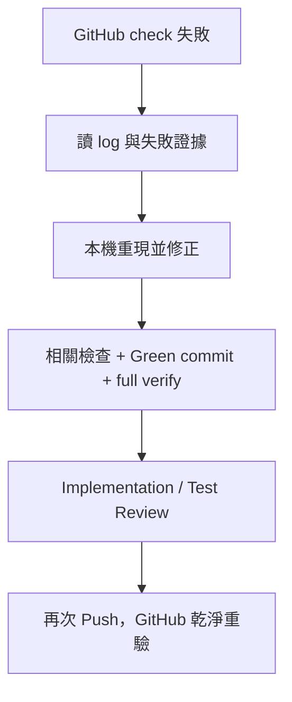

# GitHub CI/CD 設計契約

狀態：**已定義、尚未實作**。第一階段不得建立 `.github/workflows/` 或假 required checks。

## 定位

本機是快速、可觀察的主要開發迴圈；GitHub 是乾淨環境的正式重驗與不可繞過的 Merge Gate。正常 PR 在 Push 前已本機綠，GitHub failure 是環境差異、遺漏或真正回歸的證據，不是預設除錯方法。

Codex Cloud 可在未來成為另一個工作入口，但不是第一版前置條件；Cloud 產生的變更進入同一 branch／PR 後，仍須同一 Frozen Spec、deterministic checks、formal Review 與 ruleset。

## 第二階段才建立的 gates

### Workflow check runs

當 A+B 技術棧已知後，以 repository 的 canonical scripts 在乾淨 runner 重跑：

1. Format check（只檢查，不在 CI 靜默改檔）。
2. Lint。
3. Build／typecheck；依實際 toolchain 決定是否拆 job。
4. Unit tests；integration／E2E 只有 Frozen Spec 或真實架構需要時才加入，不把慢速 browser test 塞進 Red → Green loop。
5. Coverage 收集與已核准 threshold；threshold 在技術棧與 baseline 未知前不猜。
6. Dependency Review：repository 有 GitHub dependency graph 支援的 manifest／lockfile 時，在 PR 比較新增依賴、漏洞與 license policy。
7. 一個 Formal AI Review workflow：內部分開產出 Implementation 與 Test verdict，再匯總成一個 required check；有實測上的隔離或效能需求後才拆成兩個 workflow jobs。

Formal Review 不依賴先前本機 session，也不把 PR body 當權威輸入。Workflow 從 PR merge-base 到固定 head SHA 的 committed diff 找出唯一 `.ai-sdlc/points/<point-id>.json`，驗證 schema、`point_id` 符合 `^[a-z0-9][a-z0-9-]{0,62}$`、Spec path 是無 `..`／反斜線／前導 slash 的 repo-relative path、`point_base` 等於 merge-base、兩個 SHA 都是 40 位小寫十六進位且為 head ancestor，並驗證 `trusted_ref` 精確等於 `refs/tags/spec-freeze/<point-id>/<freeze-sha>`、其 protected tag peeled target 正是 `freeze_sha`。它從 freeze commit 讀 Spec、確認 head 同路徑 blob 未被未凍結修改，再建立兩份固定 result envelopes。manifest 缺漏／多於一份、SHA／path／ref 無法解析、blob 不一致或祖先／merge-base 關係不成立時直接 `FAIL`。

### GitHub security capabilities

- CodeQL：語言受支援時優先評估 default setup；只有 build、query pack 或矩陣需要客製化才採 advanced setup。
- Secret scanning 與 push protection：這是 repository 層的持續掃描／防護，不是假裝成每次重跑的 Format 類 job。啟用適用能力，且未處理的 secret alert 不得被忽略。
- Dependency Review、CodeQL 與 Secret Scanning 都要依 public repo、語言、生態系與 GitHub plan 的實際支援設定；不建立永遠 skip 卻被宣稱為保護的裝飾 job。

### Public repository trust boundary

- PR body、title、patch、repository file、test output 與 log 都是不可信輸入；它們不能改寫 system／review 規約、要求揭露 secret 或擴大 token 權限。
- Deterministic checks 在 `pull_request` 的 untrusted head 上以最小權限執行，不取得 writer token；Formal AI Review 也是唯讀，預設 `contents: read`，不把 comment／branch write 權限與模型憑證放在同一 job。
- 任何持有模型憑證的 Formal Review job 都只執行 trusted base revision 中 pinned 的 review adapter；不得 checkout 或執行 PR head 的 script、dependency、config、hook、自訂 action 或前一個 job 產生的 artifact。完整檔案與 diff 只按固定 head SHA 經 GitHub API 讀成不可信資料；模型沒有可讀 secrets 的 shell、agent tool 或任意 network access。這項限制同樣適用 same-repository PR。
- 不使用帶 secrets 的 `pull_request_target` checkout 或執行 fork head。Public fork PR 的 AI credential 路徑必須在第二階段選定並實測；未解決前不能把一個 fork 永遠無法通過的 AI check 設成 required。
- 若採 privileged follow-up／manual approval 來 Review fork，只透過 GitHub API 讀固定 head SHA 的 diff，不執行 PR 程式碼，也不接受 PR 內容指定工具、權限或外部目的地。
- Repair 使用獨立 actor／token，只允許已授權的 same-repository branch；不對 fork PR 啟用，也不與 Formal Review 的模型 secret 或唯讀 job 共置。

### Ruleset

Workflow 穩定、check 名稱固定後，才建立 default branch ruleset：

- 對精確 pattern `spec-freeze/*/*` 建立兩個同時 active 的 tag rulesets；因 `*` 不跨 `/`，這只覆蓋 schema 的兩個路徑片段。
- Creation ruleset 啟用「Restrict creations」，只把 trusted maintainer 設為 bypass actor；PR head workflow 不取得該身分。
- Immutability ruleset 啟用「Restrict updates」與「Restrict deletions」，不設任何 bypass actor。兩個 rulesets 疊加後，獲准 actor 只能建立新 ref，不能移動或刪除既有 ref；每個 tag 的 peeled target 是人類確認的 freeze SHA。
- 只經 PR 合併，不直接 push default branch。
- Required status checks：deterministic、coverage、Formal AI Review aggregate，以及可成為 PR check 的適用 Dependency Review／CodeQL。
- Repository settings：另行驗證 Secret Scanning、push protection 與 alert policy 已啟用；不把它們冒充每個 PR 的 status check。
- 不配置日常 bypass actor；緊急處置若未來需要，另立有稽核的 break-glass 規則。
- merge 後是否部署不是本階段範圍，不能把 CI completion 寫成已部署。

## AI Review 與可選 Repair 必須分離

Formal AI Review 是唯讀 gate：找問題、給 evidence、判定 PASS／BLOCKED，不在同一 job 偷改 branch。

Unattended Repair 是未來可選的獨立 writer，只在全自動模式且事先授權時啟用。實作前必須另行凍結：可修改路徑、禁止修改項目、最大嘗試次數、每輪驗證、commit／push 身分與終止條件。它不能改 Spec、測試門檻、workflow、ruleset、secrets 或 reviewer 本身來取得綠燈。

## Failure loop

不使用「只 rerun 看看」掩蓋 deterministic failure；只有已證明是 runner／服務 transient failure 才可單純 rerun。

## Gate Drill

Gate Drill 使用 [`WORKFLOW.md`](WORKFLOW.md) 的隔離 branch 與 Draft PR 標示，只故意漏一個本機 gate，驗證 GitHub 會阻擋。Drill 不關閉 ruleset、不降低 threshold、不與產品 PR 混用，也永不 merge。這是展示例外，不是正常工作模板。

## 建置次序

第二階段依序：在本機確認 A+B 與 CI enablement 的真實 Spec／技術棧 → 先建立上述兩個 `spec-freeze/*/*` tag rulesets → 以正常 point（Spec、manifest、trusted tag、本機 full verify、雙 Review）提交 CI enablement PR → 在該 PR 只驗證 deterministic workflow 與 Formal Review adapter 的無憑證測試，不能聲稱尚未存在的 trusted Formal AI Review 已成為 gate → 以一次性、明列證據的人工 bootstrap merge 完成 trust anchor → 從 default branch 執行並實測 Formal AI Review → check 名稱穩定後立即建立無日常 bypass 的 default branch ruleset → 第一個 A+B implementation point 才開始。這個 bootstrap gap 只解決「gate 不能保護建立自己的第一個 PR」的因果順序，不能沿用到產品變更。Repair 與 Codex Cloud 都是可選後續，不阻擋第一版。
